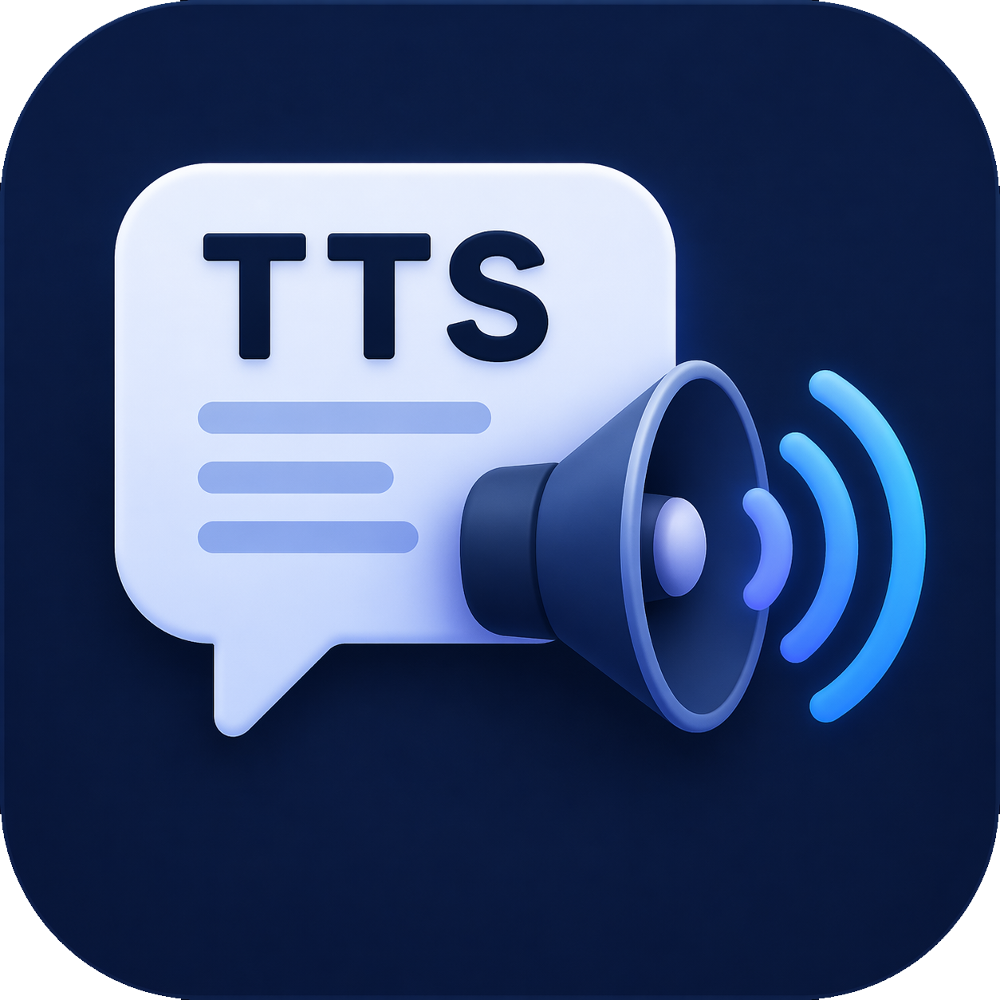

# TTS Studio

A dual-target text-to-speech application that runs as both a **native desktop app** (via [Electrobun](https://electrobun.dev/)) and an installable **Progressive Web App** (served by Bun). It pairs hosted Microsoft Edge online voices (322+) with browser-based speech recognition and free machine translation.



## Features

- **Hosted voice catalog** — ~322 Microsoft Edge neural voices via `edge-tts` / `node-edge-tts`, filterable by language and search.
- **Live preview & save** — waveform visualization, in-app playback, and explicit save-as dialog.
- **Speech-to-Text** — dictation using the browser's built-in `SpeechRecognition` engine in any supported language.
- **Translation** — free translation pipeline (LibreTranslate primary, MyMemory fallback) with one-click send to TTS.
- **Responsive UI** — two-column layout on desktop, single column on phones, accessible focus rings, reduced-motion support.
- **Light & dark theme** — system-preference default, manual toggle persisted in `localStorage`.
- **PWA support** — installable on Chrome, Edge, Safari, and mobile; offline shell via service worker.

## Quick start

Prerequisites: [Bun](https://bun.sh/) ≥ 1.1, Node.js ≥ 18 (for the `edge-tts` helper).

```powershell
bun install
```

### Desktop (Electrobun)

```powershell
bun run dev        # launch the desktop app in dev mode
bun run build      # package the desktop app
```

Installer builds:

```powershell
bun run build:installer     # stable .zst + PowerShell installer in artifacts/
bun run build:canary
```

### Web / PWA

```powershell
bun run dev:web       # watch mode, http://localhost:8003
bun run start:web     # production mode
bun run deploy        # alias of start:web, suitable for hosting
```

Set the port with the `PORT` env var:

```powershell
$env:PORT = "8080"; bun run start:web
```

Open `http://localhost:8003/` in a Chromium-based browser and click the install icon in the address bar to install as a PWA. On iOS Safari, use **Share → Add to Home Screen**.

## Architecture

| Layer            | Desktop                                      | Web                                                          |
| ---------------- | -------------------------------------------- | ------------------------------------------------------------ |
| Shell            | Electrobun WebView (`src/bun/index.js`)      | Bun HTTP server (`src/web/server.js`)                        |
| Transport        | Electrobun RPC (`electrobun/view`)           | `fetch` via browser shim (`src/web/electrobun-view-shim.js`) |
| UI               | `src/views/mainview/index.html`              | `src/views/mainview/index.web.html`                          |
| Shared view code | `src/views/mainview/{index.js,styles.css}`   | Same — zero changes                                          |
| TTS engine       | `src/bun/tts-service.js` → `edge-tts` helper | Same                                                         |

The web entry re-implements the `Electroview` API with the same `rpc.request.*` surface, so the single `index.js` view module runs unchanged on both platforms.

## Endpoints (web)

| Method | Path                    | Purpose                                      |
| ------ | ----------------------- | -------------------------------------------- |
| GET    | `/api/runtime`          | Runtime probe                                |
| GET    | `/api/voices`           | Hosted voice catalog                         |
| POST   | `/api/synthesize`       | Synthesize text → MP3                        |
| POST   | `/api/cancel-synthesis` | Cancel an in-flight synthesis by `requestId` |
| POST   | `/api/translate`        | Translate text between languages             |
| GET    | `/manifest.webmanifest` | PWA manifest                                 |
| GET    | `/service-worker.js`    | Service worker (scope `/`)                   |

## Project layout

```
src/
  bun/              # Bun entry, TTS service, edge-tts helper
  shared/           # Error codes and shared helpers
  views/mainview/   # Shared HTML/CSS/JS for desktop + web
  web/              # HTTP server, browser shim, PWA assets
scripts/            # Build + installer scripts
artifacts/          # Published installers
```

## Theme toggle

- Class hook: `#themeToggle` in the top bar; writes `document.documentElement.dataset.theme` and `localStorage["tts-studio.theme"]`.
- CSS: tokens defined on `:root` (light) and `[data-theme="dark"]` in `src/views/mainview/styles.css`.
- Default: follows `prefers-color-scheme`.

## License

Private / unlicensed.
